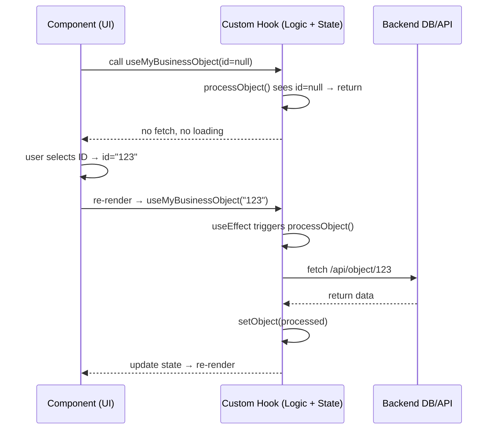

## 📘 **React State + Custom Hook Cheatsheet**  
### *“Logic updates state; components consume logic and render UI.”*

---

## 🧩 **1. Custom Hook (`./src/hooks/useMyBusinessObject.ts`)**

```ts
import { useState, useEffect } from "react";

export default function useMyBusinessObject(id: string | null) {
  const [object, setObject] = useState<any>(null);
  const [loading, setLoading] = useState(false);

  async function processObject() {
    if (!id) return; // Skip if id is empty

    setLoading(true);

    const res = await fetch(`/api/object/${id}`);
    const data = await res.json();

    const processed = {
      ...data,
      processedAt: new Date().toISOString()
    };

    setObject(processed);
    setLoading(false);
  }

  useEffect(() => {
    processObject();
  }, [id]);

  return { object, loading, processObject };
}
```

### **Hook Responsibilities**
- Holds **state** (`object`, `loading`)
- Provides **logic** (`processObject`)
- Interacts with **backend**
- Encapsulates **business rules**
- Returns **state + logic** to the component

---

## 🧩 **2. Component (`./src/components/MyBusinessComponent.tsx`)**

```tsx
import useMyBusinessObject from "@hooks/useMyBusinessObject";

function MyBusinessComponent({ id }: { id: string | null }) {
  const { object, loading, processObject } = useMyBusinessObject(id);

  if (!id) {
    return <p>Please select an object.</p>;
  }

  if (loading) {
    return <p>Loading...</p>;
  }

  return (
    <div>
      <h2>Business Object</h2>
      <pre>{JSON.stringify(object, null, 2)}</pre>

      <button onClick={processObject}>
        Refresh Object
      </button>
    </div>
  );
}

export default MyBusinessComponent;
```

### **Component Responsibilities**
- Calls the hook to “borrow” its logic  
- Renders UI based on hook state  
- Triggers hook logic via user interaction  
- Stays clean and focused on presentation  

---

## 🔄 **3. How React Ties Them Together**

### **Step-by-step flow**
1. Component renders  
2. Component calls `useMyBusinessObject(id)`  
3. Hook initializes state (`object`, `loading`)  
4. Hook runs `useEffect` → calls `processObject()`  
5. Hook fetches data from backend  
6. Hook transforms data → calls `setObject()`  
7. React re-renders component  
8. Component displays updated business object  
9. User clicks “Refresh” → component calls `processObject()` again  
10. Hook updates state → React re-renders  

---

## 📉 **4. Sequence Diagram**  
### *Component → Hook → Backend → Hook → Component*



---

## 🧠 **5. Core Concept (One Sentence)**

**React gives you primitive state logic (`useState`).  
Your custom hook wraps that primitive in business logic (`processObject`).  
Your component consumes your custom logic and renders UI.**

---


